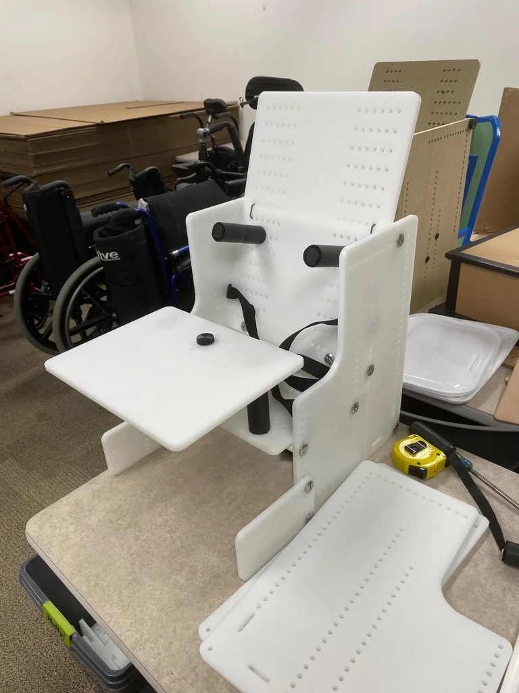

# Therapy Chair
ATP's, PT's, and OT's working with children with physical disabilities often need an appropriate seating system to provide support to enable the kiddo to engage with their environment and participate in strengthening exercises. In the past we measured each child and built it, usually out of triwall, to their size to ensure a good fit. The benefit of this new design is the chair is more durable/easier to clean than triwall and is adjustable. It resembles Swiss cheese to allow placement of laterals virtually anywhere. It can work as a chair or floor sitter. It can incline forward 5 degrees or lay all the way back flat. At the time we are writing this, the cost came in around $100/chair for 7 chairs that we made. This isn't going to work for every kiddo, but we leave it up to you to adapt it further for your unique situation.

<!--
## More info at
- [Makers Making Change Project Page](https://makersmakingchange.com/project/therapy-chair/)
-->

## How to Obtain a Therapy Chair
### 1. Do it Yourself (DIY) or Do it Together (DIT)

This is an open-source assistive technology, so anyone is free to build it. All of the files and instructions required to build the Therapy Chair are contained within this repository. Refer to the Maker Checklist below.

### 2. Request a build of this device

If you would like to obtain a Therapy Chair, you may submit a build request through the [MMC Library Page](https://makersmakingchange.com/project/therapy-chair/). The requestor is responsible for the cost of materials and any shipping.

### 3. How to build this device for someone else

If you have the skills and equipment to build this device, and would like to donate your time to create the switch for someone who needs it, visit the [MMC Maker Wanted](https://makersmakingchange.com/maker-wanted/) section.

## Getting Started

### 1. Read the Makers Checklist

[The Makers Checklist](/Documentation/Therapy_Chair_Maker_Checklist_V1.0.pdf)

### 2. Order the Off-The-Shelf Components

The [Bill of Materials](/Documentation/Therapy_Chair_BOM_V1.0.xlsx) lists all of the parts and components required to build the Therapy Chair. The main switch component needs to be ordered online. The rest of the off-the-shelf components are also online or may be available in smaller quantities at your local hardware store or dollar store.

### 3. CNC Rout the body panels

The DXF files can be in the [CNC Files](/Build_Files/CNC_Files) folder.

### 4. Assemble the Therapy Chair

Reference the [Assembly Guide](/Documentation/Device-Name_Assembly_Guide_V1.0.pdf) for the tools and steps required to build each portion.

## Files
### Documentation
| Document             | Version | Link |
|----------------------|---------|------|
| Design Rationale     | 1.0     | [Therapy_Chair_Design_Rationale](/Documentation/Therapy_Chair_Design_Rationale_V1.0.pdf)     |
| Maker Checklist      | 1.0     | [Therapy_Chair_Maker_Checklist](/Documentation/Therapy_Chair_Maker_Checklist_V1.0.pdf)     |
| Bill of Materials    | 1.0     | [Therapy_Chair_Bill_of_Materials](/Documentation/Therapy_Chair_BOM_V1.0.xlsx)     |
| Assembly Guide       | 1.0     | [Therapy_Chair_Assembly_Guide](/Documentation/Therapy_Chair_Assembly_Guide_V1.0.pdf)     |
| User Guide           | 1.0     | [Therapy_Chair_User_Guide](/Documentation/Therapy_Chair_User_Guide_V1.0.pdf)    |
| Changelog            | 1.0     | [Therapy_Chair_Changelog](/Documentation/Therapy_Chair_Changelog_V1.0.pdf)     |

### Build Files
 - [CNC Files](/Build_Files/CNC_Files)

## Attribution
Designers:
 - [Design](https://www.instructables.com/Child-Therapy-Chair/) by [Utah Assistive Technology Program](https://www.instructables.com/member/uatpat/)
 - Documentation by Neil Squire Society/Makers Making Change

## License
Everything needed or used to design, make, test, or prepare the Therapy Chair is licensed under the [Attribution-NonCommercial-ShareAlike 4.0 ](https://creativecommons.org/licenses/by-nc-sa/4.0/).

Accompanying material such as instruction manuals, videos, and other copyrightable works that are useful but not necessary to design, make, test, or prepare the THerapy Chair are published under a Creative Commons Attribution-ShareAlike 4.0 license https://creativecommons.org/licenses/by-sa/4.0/ (CC BY-SA 4.0).

----

<!-- ABOUT MMC START -->
## About Makers Making Change

Makers Making Change is an initiative of [Neil Squire](https://www.neilsquire.ca/), a Canadian non-profit that helps people with disabilities.

We are committed to creating a network of volunteer makers who support people with disabilities in their communities through 3D printing assistive devices. Check out our library of free, open-source assistive technologies with parts and build instructions.

 - Website: [www.MakersMakingChange.com](https://www.makersmakingchange.com/)
 - GitHub: [https://github.com/makersmakingchange](https://github.com/makersmakingchange)
 - Twitter: [@makermakechange](https://twitter.com/makermakechange)
 - Instagram: [@makersmakingchange](https://www.instagram.com/makersmakingchange)

## Contact Us
For technical questions, to get involved, or share your experience we encourage you to visit the [MMC Website](https://www.makersmakingchange.com/), [MMC Forum](https://makersmakingchange.com/forum), or contact info@makersmakingchange.com
<!-- ABOUT MMC END -->
